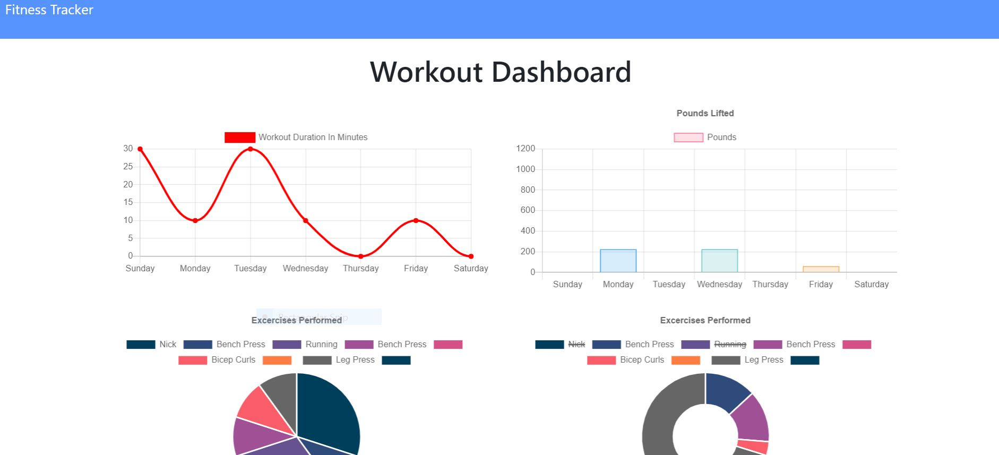

# workoutTracker
Unit 17 - Nosql

## Description

This app is a workout tracker. With this app a user would be able to view create and track daily workouts. They can log multiple exercises in a workout on a given day. They can also be able to track the name, type, weight, sets, reps, and duration of exercise.  Additionally, if the exercise is a cardio exercise, the user can track their distance traveled.

This app requires a Mongo database with a Mongoose schema and handles routes with Express.

## Table of Contents

- [Installation](#Installation)
- [Usage](#Usage)
- [License](#License)
- [Contribution](#Contribution)
- [Testing](#Testing)
- [Questions](#Questions)

## Installation

- NPM Install
- Express
- Mongo DB
- Mongoose

### public

This folder contains:

- api.js
- exercise.html
- exercise.js
- index.html
- index.js
- stats.html
- stats.js
- style.css
- workout.js
- workout-style.css

### routes

This folder contains the different routes needed:

- api.js
- htmlRoutes.js

### seeders

This folder contains the seed file:

- seed.js

### Additional Files

- package.json
- package-lock.json
- "node_modules" Folder
- server.js

## Usage

## License

MIT License

Copyright (c) [2020] [Nicholas Foreman]

Permission is hereby granted, free of charge, to any person obtaining a copy
of this software and associated documentation files (the "Software"), to deal
in the Software without restriction, including without limitation the rights
to use, copy, modify, merge, publish, distribute, sublicense, and/or sell
copies of the Software, and to permit persons to whom the Software is
furnished to do so, subject to the following conditions:

The above copyright notice and this permission notice shall be included in all
copies or substantial portions of the Software.

THE SOFTWARE IS PROVIDED "AS IS", WITHOUT WARRANTY OF ANY KIND, EXPRESS OR
IMPLIED, INCLUDING BUT NOT LIMITED TO THE WARRANTIES OF MERCHANTABILITY,
FITNESS FOR A PARTICULAR PURPOSE AND NONINFRINGEMENT. IN NO EVENT SHALL THE
AUTHORS OR COPYRIGHT HOLDERS BE LIABLE FOR ANY CLAIM, DAMAGES OR OTHER
LIABILITY, WHETHER IN AN ACTION OF CONTRACT, TORT OR OTHERWISE, ARISING FROM,
OUT OF OR IN CONNECTION WITH THE SOFTWARE OR THE USE OR OTHER DEALINGS IN THE
SOFTWARE.

(https://img.shields.io/badge/license-MIT-blue.svg)

## Contribution

N/A

## Testing

NPM Test

## Questions

If you have any additional questions, feel free to contact me via email:
nicholas.m.foreman@gmail.com

* ![GitHub license] (https://img.shields.io/badge/license-MIT-blue.svg)